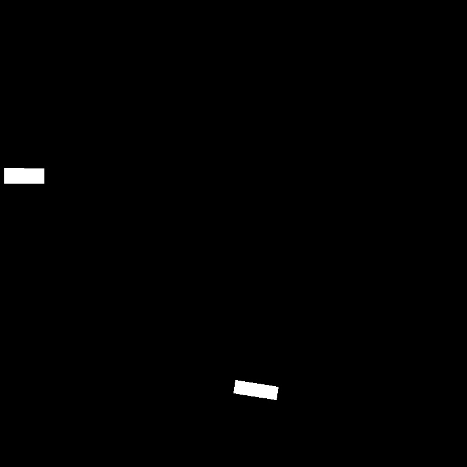

# Airbus Ship Detection Challenge
This repository contains segmentation solution to the Airbus Ship Detection Challenge. 

## Requirements
To run the code in this repository, you need the main following dependencies (others are in requirements.txt):
it is preferably to install `python 3.8.10`, the code is tested for this version of python. 
OS: ```ubuntu 20.04 LTS``` 

```
tensorflow==2.8
opencv==4.8.0
numpy
pandas
matplotlib
```

You can install the dependencies by running the following command:

```
pip install -r requirements.txt
```

## EDA
EDA notebook is located in notebooks directory. The color statictics, ship analysis was done in EDA.ipynb.

## Weights and data
Download the dataset from the [Airbus Ship Detection Challenge](https://www.kaggle.com/competitions/airbus-ship-detection) page on Kaggle.

Download the custom UNet model weights file from the given [link](https://drive.google.com/file/d/18a_xLw9ghw5K5BvR5xdBIdzNtrpPmWYc/view?usp=sharing) and Unet from `segmentation-models` framework: [link](https://drive.google.com/file/d/1CXPyAUho1WCkzCTo88IWK8ihnEgsao8w/view?usp=sharing)

## Train
Download and extract the dataset files into the directory `$PROJECT_PATH/data/`.

Train the ship detection model by running the training script:
```
python src/train.py --output_weights=./output_directory/final_weights.h5 --checkpoint_dir ./checkpoints/ --image_size 768 768 --batch_size 16
```
Evaluate the model on the test set by running the test script (the weights can be both from custom model custom_unet_weights.py and library model unet_library_weights.hdf5):
```
python src/test.py --image_size 768 768 --batch_size 1 --weights ./weights/unet_library_weights.hdf5 --test_dir data/test_v2
```
To use the model directly as inference, run the following script (replace pathes as needed)
```
python src/inference.py --image_path ./data/train_v2/1c40bdeaa.jpg --weights ./weights/unet_library_weights.hdf5 --output_path ./predictions/1c40bdeaa.jpg
```

## Examples
original image | mask | prediction
--- | --- |---
||
||
